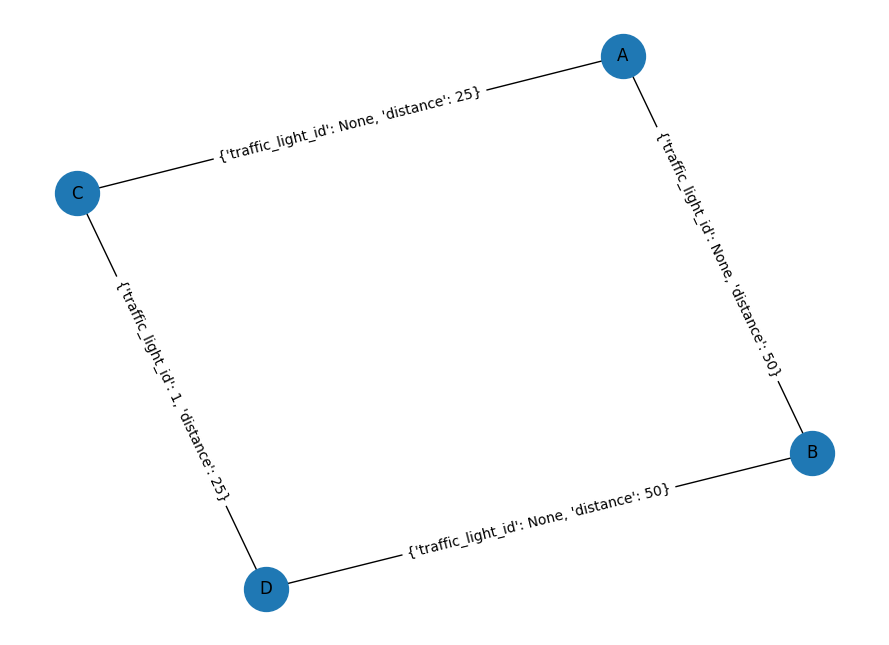

### Start

Executing server:

`docker-compose up --build server_hello`

Executing spade container:

`docker-compose up --build spade_hello`

### Koncepcja

- reprezentujemy strukturę dróg jako graf:
  
- węzły - skrzyżowania
- krawędzie - odcinki dróg pomiędzy skrzyżowaniami
- każda krawędź ma metadane w tym:
  - długość (distance)
  - liczba samochodów na tej krawędzi (jak duży jest ruch) (TODO)
  - jakie jest światło które odpowiada jechaniu w tę stronę (czerwone zwiększa wagę krawędzi???)
  - coś jeszcze?
- algorytm najkrótszej ścieżki wyznacza trasę pojazdu uwzględniając wagi krawędzi
- **propozycja uproszczonego modelu**: pozycję pojazdu uprzywilejowanego oznaczamy przez krawędź na której się znajduje (czyli dwa węzły definiują krawędź). Czas przejazdu przez każdą krawędź jest zależny _liniowo_??? od wagi tej krawędzi. Jeżeli samochód jedzie już po krawędzi wymagany czas i światło na kolejnej wybranej krawędzi jest zielone to może na nią wjechać. Jeżeli nie to czeka na zielone.
- Na prezentacji można potem pokazać przykładową trasę w postaci kolejnych snapshotów stanu grafu (pokolorujemy krawędzie w zależności od światła itd.)
